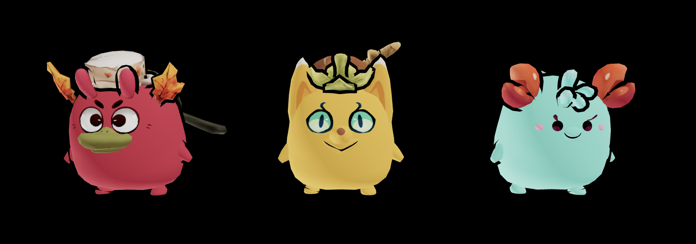

<div alt style="text-align: center;">
	<picture>
		
	</picture>
</div>

# Axie Starter

Create new adventure with Buba, Pomodoro, and Puffy using [@react-three/fiber](https://docs.pmnd.rs/react-three-fiber/getting-started/introduction) and [threejs](https://threejs.org/docs/#manual/en/introduction/Installation).

## Installation

```sh
npm i @sms0nhaaa/r3f-axie-starter
```

```sh
yarn add @sms0nhaaa/r3f-axie-starter
```

```sh
bun add @sms0nhaaa/r3f-axie-starter
```

## Usage

```ts
export type OutlinesProps = {
  /** Outline color */
  color: string
  /** Outline opacity */
  opacity: number
  /** Outline thickness */
  thickness: number
}

type AxieStarterProps = JSX.IntrinsicElements['group'] & {
  /** Number of frames to render, Infinity */
  outline?: OutlinesProps
  /** Animation to play  */
  animation?:
    | 'idle'
    | 'idleattack'
    | 'idlecarryitem'
    | 'jump'
    | 'run'
    | 'runattack'
    | 'runcarryitem'
    | 'walk'
    | 'walkattack'
    | 'walkcarryitem'
  /** Scaling factor for the time. A value of 0 causes the animation to pause. Negative values cause the animation to play backwards. Default is 0.8   */
  timeScale?: number
}
```

```tsx
import { Buba, Pomodoro, Puffy } from '@sms0nhaaa/r3f-axie-starter'

<Buba
  animation="idle"
  outline={{ color: 'black', opacity: 1, thickness: 0.03 }}
  position={[0, 0, 0]}
  timeScale={timeScale}
/>
<Puffy
  animation="idle"
  outline={{ color: 'black', opacity: 1, thickness: 0.03 }}
  position={[2, 0, 0]}
  timeScale={timeScale}
/>
<Pomodoro
  animation="idle"
  outline={{ color: 'black', opacity: 1, thickness: 0.03 }}
  position={[-2, 0, 0]}
  timeScale={timeScale}
/>
```

## Tutorials

#### 1. Create Nextjs projects

```bash
npx create-next-app@latest
```

```bash
yarn create next-app
```

```bash
bunx create-next-app
```

The ideal NextJs project config

```sh
What is your project named?  axie-adventure
Would you like to use TypeScript?  Yes
Would you like to use ESLint?  Yes
Would you like to use Tailwind CSS?  Yes
Would you like to use `src/` directory?  Yes
Would you like to use App Router? (recommended)  Yes
Would you like to customize the default import alias?  Yes
```

#### 2. Install the dependencies

```bash
npm i @sms0nhaaa/r3f-axie-starter three @react-three/fiber @react-three/drei
```

```bash
yarn add @sms0nhaaa/r3f-axie-starter three @react-three/fiber @react-three/drei
```

```bash
bunx add @sms0nhaaa/r3f-axie-starter three @react-three/fiber @react-three/drei
```

#### 3. Setup the scene

```tsx
// app/page.tsx
'use client'

import { OrbitControls } from '@react-three/drei'
import { Canvas } from '@react-three/fiber'
import { Buba, Pomodoro, Puffy } from '@sms0nhaaa/r3f-axie-starter'

export default function Home() {
  return (
    <main className="flex w-screen h-screen">
      <Canvas>
        <ambientLight intensity={2} />
        <directionalLight intensity={1} position={[10, 10, 5]} />
        <directionalLight intensity={2} position={[-10, -10, -5]} />
        <OrbitControls
          enableDamping
          dampingFactor={0.05}
          enablePan={false}
          maxPolarAngle={Math.PI / 0.01}
          minPolarAngle={Math.PI / 10}
          rotateSpeed={1.1}
        />

        <Buba
          animation="idle"
          outline={{ color: 'black', opacity: 1, thickness: 0.03 }}
          position={[0, 0, 0]}
          timeScale={1}
        />
        <Puffy
          animation="idle"
          outline={{ color: 'black', opacity: 1, thickness: 0.03 }}
          position={[2, 0, 0]}
          timeScale={1}
        />
        <Pomodoro
          animation="idle"
          outline={{ color: 'black', opacity: 1, thickness: 0.03 }}
          position={[-2, 0, 0]}
          timeScale={1}
        />
      </Canvas>
    </main>
  )
}
```

#### 4. Run the project

```bash
npm run dev
```

```bash
yarn dev
```

```bash
bun dev
```
